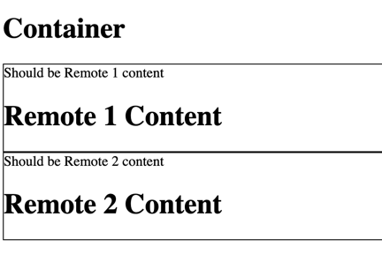
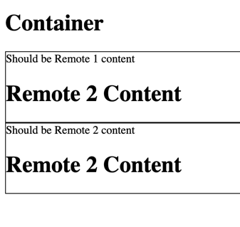

install the packages at the root, in project, in project/layout, in project/remote1, in project/remote2

`yarn works` - runs correctly because hot reload is off

`yarn bad` - does not run correctly because hot reload is on

